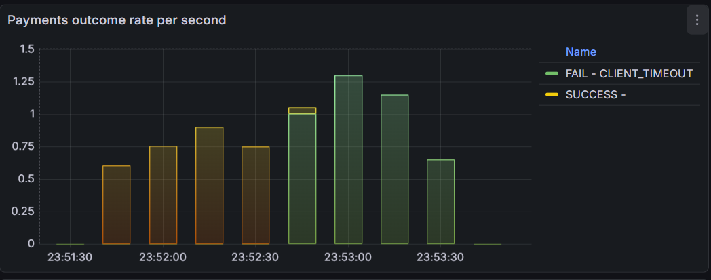
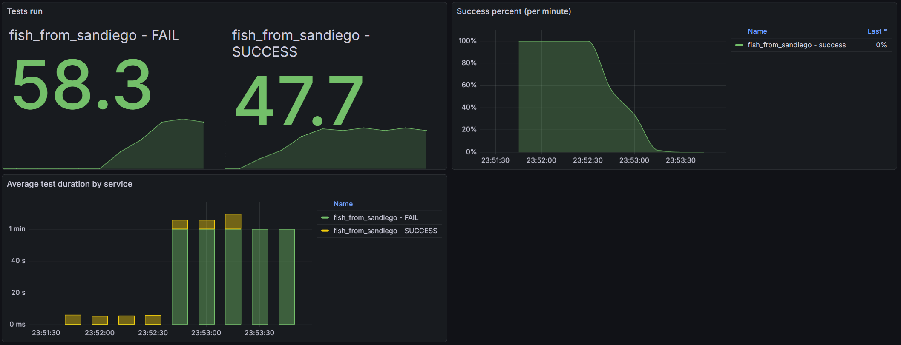
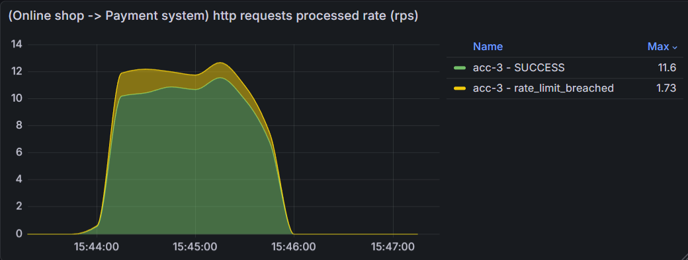
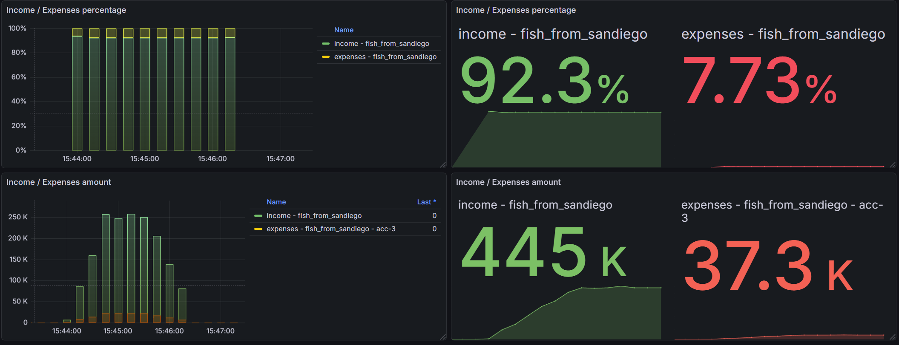
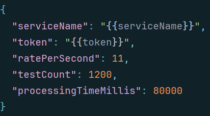
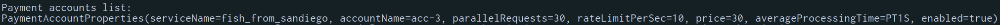
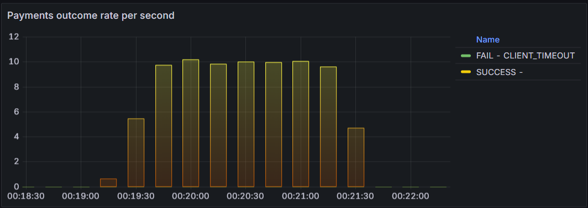
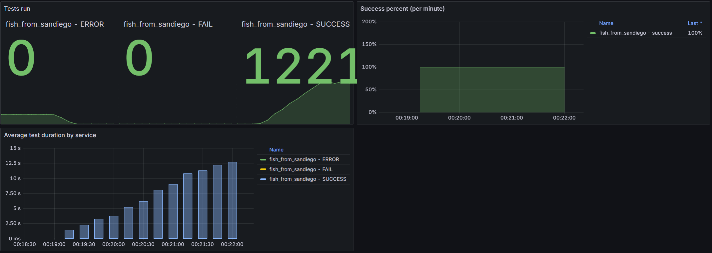
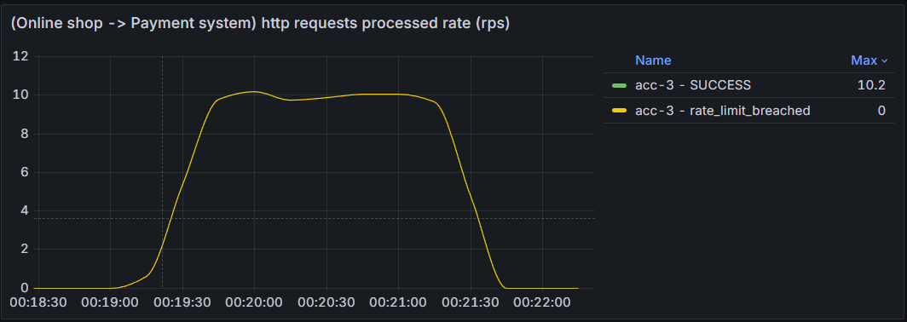
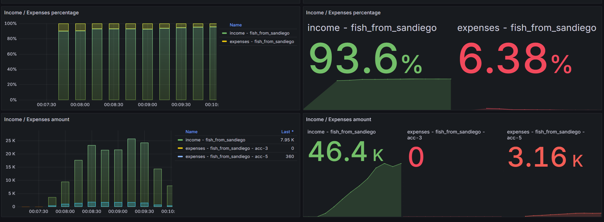

## Case 1
<hr>

### Что не работало

На графике исходов оплаты можно увидеть, что с определённого момента часть оплат даёт результат CLIENT_TIMEOUT:



<br>

Неудачные тесты длятся очень долго:



<br>

Сервис оплаты отказывает некоторым запросам из-за превышения лимита:



<br>

Показатели дохода немного меньше целевых 93/7:



### Почему так происходило

От пользователей запрашивалось 11 оплат в секунду:



<br> 

В то время как аккаунт ограничивает поток запросов 10 в секунду:



<br>

Сервис магазина при получении запроса от пользователя без каких-либо проверок и условий посылает запрос сервису оплаты со всех аккаунтов (в данном случае только acc-3). Так как от пользователей приходит больше запросов в секунду, чем может обработать сервис оплаты, и эти запросы перенаправляются на него очень быстро, часть обращений магазина к сервису оплаты не проходят с ответом "Rate limit for account: acc-3 breached". Пользователь ждёт 80 секунд, но оплата за это время не завершается успешно (так как мы не пытаемся провести её ещё раз после неудачи), и тесты, на которые пришлись нарушения rate limit, не проходят и длятся как раз около 80 секунд.

### Что именно добавлено/изменено

Я воспользовался реализованным в common.utils rate limiter со скользящим окном и добавил блокировку потока перед обращением к сервису оплаты в случае, если превышен лимит запросов от клиентов магазина в account.rateLimitPerSec за последнюю секунду:

```kotlin
    private val rateLimiter = SlidingWindowRateLimiter(rateLimitPerSec.toLong(), Duration.ofSeconds(1))

    override fun performPaymentAsync(paymentId: UUID, amount: Int, paymentStartedAt: Long, deadline: Long) {
        rateLimiter.tickBlocking()

        logger.warn("[$accountName] Submitting payment request for payment $paymentId")
        ...
```

### Почему эти изменения исправляют проблему

Теперь при вызове performPaymentAsync, если за последнюю секунду rate limiter уже дал rateLimitPerSec потокам исполняться и слать запрос сервису оплаты, выполнение текущего блокируется, пока rate limiter не выкинет из своей очереди старые записи (те, которые хотя бы на секунду отстают от текущего времени). Таким образом, можно ограничить поток запросов к сервису оплаты значением, указанным в аккаунте.

<br>

При этом запросы обрабатываются в сервисе оплаты в среднем 1 секунду и пользователь готов ждать целых 80 секунд, поэтому они накапливаются медленно, и при значениях из кейса 1 и аккаунта 3 маловероятна ситуация, что поток, обрабатывающий оплату, проведёт в блокировке достаточно времени, чтобы запрос зафейлился с CLIENT_TIMEOUT.

### Результаты после исправления (remote)



<br>



<br>



<br>

